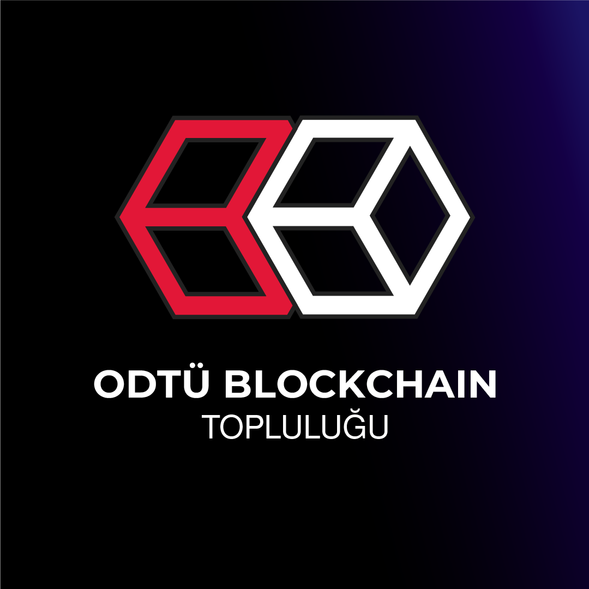

  

# ODTÜ Blockchain Topluluğu - Web3 & Blockchain Roadmap

ODTÜ Blockchain Topluluğu katılımcıları için hazırlanmış kapsamlı blockchain ve Web3 öğrenme yol haritası.

**Language / Dil**: [🇹🇷 Türkçe](#türkçe) | [🇬🇧 English](#english)

---

## 🇹🇷 Türkçe

### 📋 İçindekiler

- [Genel Bakış](#genel-bakış)
- [Developer Roadmap](#developer-roadmap)
- [Non-Developer Roadmap](#non-developer-roadmap)
- [Kaynaklar](#kaynaklar)
- [Katkıda Bulunma](#katkıda-bulunma)

### 🎯 Genel Bakış

Bu roadmap, blockchain ve Web3 ekosistemine yeni başlayan veya kendini geliştirmek isteyen ODTÜ Blockchain Topluluğu üyeleri için hazırlanmıştır. Roadmap iki ana kategoriye ayrılmıştır:

1. **Developer Roadmap**: Blockchain geliştiricileri için teknik yol haritası
2. **Non-Developer Roadmap**: Marketing, Design, Community Management gibi teknik olmayan roller için yol haritası

### 👨‍💻 Developer Roadmap

Blockchain geliştiricisi olmak isteyenler için adım adım öğrenme yolu. Detaylar için [developer/README.md](developer/README.md) dosyasına bakın.

### 🎨 Non-Developer Roadmap

Blockchain ekosisteminde teknik olmayan roller için yol haritası. Detaylar için [non-developer/README.md](non-developer/README.md) dosyasına bakın.

**Kapsanan Konular:**
- Genel Bilgiler
- Regulation (Düzenlemeler)
- DeFi (Decentralized Finance)
- Jobs (Kariyer Yolları)
  - Marketing
  - Design
  - Community Management
  - Content Creation
  - Business Development

### 📚 Kaynaklar

Ek kaynaklar, araçlar ve referanslar için [resources/](resources/) klasörüne bakın.

### 🤝 Katkıda Bulunma

Bu roadmap'i geliştirmek için katkıda bulunmak isterseniz, lütfen [CONTRIBUTING.md](CONTRIBUTING.md) dosyasını okuyun.

---

## 🇬🇧 English

### 📋 Table of Contents

- [Overview](#overview)
- [Developer Roadmap](#developer-roadmap-1)
- [Non-Developer Roadmap](#non-developer-roadmap-1)
- [Resources](#resources)
- [Contributing](#contributing)

### 🎯 Overview

This roadmap is prepared for METU Blockchain Community members who are new to or want to develop themselves in the blockchain and Web3 ecosystem. The roadmap is divided into two main categories:

1. **Developer Roadmap**: Technical roadmap for blockchain developers
2. **Non-Developer Roadmap**: Roadmap for non-technical roles such as Marketing, Design, Community Management

### 👨‍💻 Developer Roadmap

Step-by-step learning path for those who want to become blockchain developers. See [developer/README.md](developer/README.md) for details.

### 🎨 Non-Developer Roadmap

Roadmap for non-technical roles in the blockchain ecosystem. See [non-developer/README.md](non-developer/README.md) for details.

**Covered Topics:**
- General Information
- Regulation
- DeFi (Decentralized Finance)
- Jobs (Career Paths)
  - Marketing
  - Design
  - Community Management
  - Content Creation
  - Business Development

### 📚 Resources

See [resources/](resources/) folder for additional resources, tools and references.

### 🤝 Contributing

If you want to contribute to the development of this roadmap, please read the [CONTRIBUTING.md](CONTRIBUTING.md) file.

---

## 📝 License

Bu proje ODTÜ Blockchain Topluluğu tarafından hazırlanmıştır. / This project is prepared by METU Blockchain Community.

**Not**: Bu roadmap sürekli güncellenmektedir. / **Note**: This roadmap is constantly updated.
